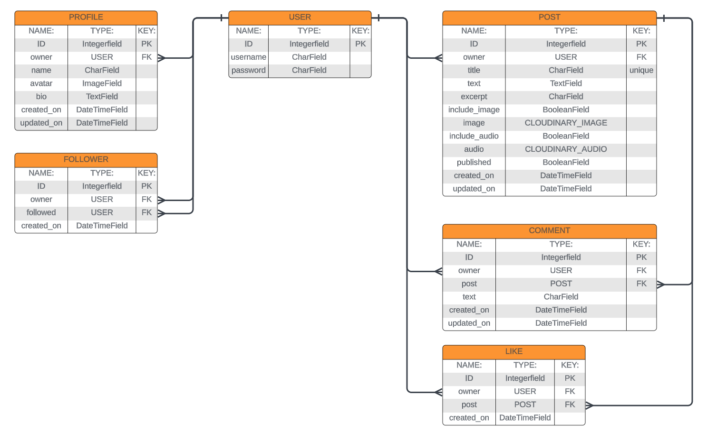

# xPress API
**Developer: Gustaaf Milzink**

[Live Website]() coming soon...

This repository contains the Django REST Framework API for the xPress front end application.

[Repository]() coming soon...

[Live Website]() coming soon...

## Table of Contents
  - [User Stories](#user-stories)
  - [Database](#database)
  - [Technologies Used](#technologies-used)
  - [Validation](#validation)
  - [Testing](#testing)
  - [Credits](#credits)

## User Stories
The projects back-end section is focussed on it's administrative functionality and adresses a single user story:
- As site admin , I want to be able to create, edit and delete Users, Posts and Comments, so that I can have full control over the sites content and be able to remove any inapropriate content.

## Database

The following models were created to represent the database model structure of the application:

#### User Model

#### Profile Model

#### Follower Model

#### Post Model

#### Comment Model

#### Like model

##### Back to [top](#table-of-contents)

## Technologies Used

### Languages & Frameworks

- Python
- Django

### Libraries & Tools

##### Back to [top](#table-of-contents)

## Validation

### Python Validation

## Testing

### Manual testing

### Automated testing

##### Back to [top](#table-of-contents)

## Credits

### Code

##### Back to [top](#table-of-contents)