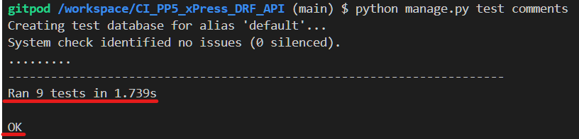

# xPress API
**Developer: Gustaaf Milzink**

[Live API](https://xpress-drf-api-96b1c58706ca.herokuapp.com/)

This repository contains the Django REST Framework API for the xPress front-end application.

[Repository](https://github.com/G-Milzink/CI_PP5_xPress_react_frontend)

[Live Website](https://xpress-react-frontend-611bb46bac21.herokuapp.com/)
## Table of Contents
  - [User Stories](#user-stories)
  - [Database](#database)
  - [Technologies Used](#technologies-used)
  - [Validation](#validation)
  - [Testing](#testing)
  - [Credits](#credits)

## User Stories
The projects back-end section is focussed on it's administrative functionality and adresses a single user story:
- As site admin , I want to be able to create, edit and delete Users, Posts and Comments, so that I can have full control over the sites content.

## Database

The following models were created to represent the database model structure of the application:

#### User Model
Contains information about the user.
Part of the Django allauth library.

- OneToOne relation with Profile model "owner" field.
- ForeignKey relation with Follower model "owner" field.
- ForeigKey relation with Follower model "followed" field.
- ForeignKey relation with Post model "owner" field.
- ForeignKey relation with Comment model "owner" field.
- ForeignKey relation with Like model "owner" field.

#### Profile Model
Contains the following fields:

"owner", "name", "avatar", "bio", "created_on" and "updated_on".
- OneToOne relation between "owner" field and User model "ID" field.
#### Follower Model
Contains the following fields:

"owner", "followed" and "created_on".
- ForeignKey relation between "owner" field and User model "ID" field.
- ForeignKey relation between "followed" field and User model "ID" field.

#### Post Model
Contains the following fields:

"owner", "title", "incclude_text", "text", "excerpt", "include_image", "image", "include_audio", "audio", "published", "created_on" and "updated_on".
- ForeignKey relation between "owner" field and User model "ID" field.

#### Comment Model   
Contains the following fields:

"owner", "post", "text", "created_on" and "updated_on".
- ForeignKey relation between "owner" field and User model "ID" field.
- ForeignKey relation between "post" field and Post model "ID" field.

#### Like model
Contains the following fields:

"owner", "post" and "created_on".
- ForeignKey relation between "owner" field and User model "ID" field.
- ForeignKey relation between "post" field and Post model "ID" field.

##### Back to [top](#table-of-contents)

## Technologies Used

### Languages & Frameworks

- Python
- Django

### Libraries & Tools
- [Git](https://git-scm.com/) - Version control system. Used for version control and pushing code to GitHub.
- [GitHub](https://github.com/) - Cloud based hosting service. Used as  remote repository to store project code.
- [Gitpod](https://gitpod.io) - Cloud based development environment. Used to host a virtual workspace.
- [Django REST Framework](https://www.django-rest-framework.org/) - API toolkit. Used this to build the back-end API.
- [Django AllAuth](https://django-allauth.readthedocs.io/en/latest/index.html) - API Module. Used for user authentication.
- [Psycopg2](https://pypi.org/project/psycopg2/) - PostgreSQL database adaptor. Used as a PostgreSQL database adapter for Python
- [Cloudinary](https://cloudinary.com/) - Online file storage. Used to store all images and audio files.
- [ElephantSQL](https://www.elephantsql.com/) - Database hosting service. Deployed project uses an ElephantSQL database.
- [Lucid](https://lucid.app/) - Web-based diagramming application. Used to create database schema. 

##### Back to [top](#table-of-contents)

## Validation

### Python Validation

During development all Python code has been continuously checked for warings and error using [Pycodestyle](https://pypi.org/project/pycodestyle/)
No errors were reported in the final code.

## Testing

The following tests were carried out on the app:
- Manual testing of user stories
- Automated testing

### Manual testing

- As site admin , I want to be able to create, edit and delete Users, Posts and Comments, so that I can have full control over the sites content.

**Test** | **Action** | **Expected Result** | **Actual Result** 
---------|------------|---------------------|------------------
User | Create, update & delete user | A user can be created, edited or deleted | Works as expected 
Profile | Create, update & delete | User profile can be created, edited or deleted | Works as expected
Post | Create, update & delete | A post can be created, edited or deleted | Works as expected
Comment | Create, update & delete | A comment can be created, edited or deleted | Works as expected

Screenshots - USER

    
     
    
     
    
     
    
     
    
     

Screenshots - PROFILE

    
     
    
     
    
     

Screenshots - POST

    
     
    
     
    
     

Screenshots - COMMENT

    
     
    
     

### Automated testing

Automated testing was done using the Django Rest Framework APITestCase.

- Tests summary

Individual app report

Combined app report

##### Back to [top](#table-of-contents)

## Credits

### Code

### Code

This project was created based on the Code Institute's Django REST API walkthrough project ['Moments'](https://github.com/Code-Institute-Solutions/drf-api).
Extra functionality was added such as: Creating a draft post, the ability to post audio, the ability to exclude specific post components from publication while storing them inside the post.

##### Back to [top](#table-of-contents)